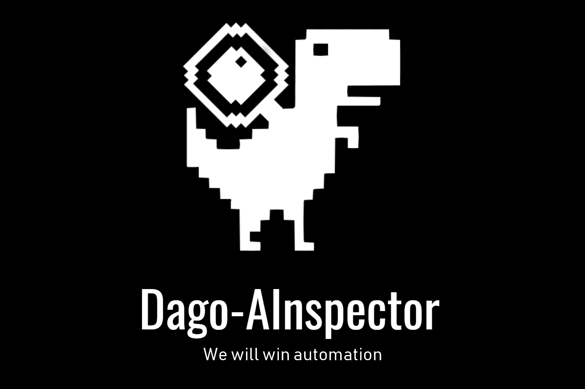

# defect-inspection.accenture-hackatum
<div align="center">
<p>
   </a>
</p>
</div>
<h3>How-to-run</h3>
To update the database detection, simply run
```bash
$ git clone https://github.com/yudz-ai/defect-inspection.accenture-hackatum
$ cd defect-inspection.accenture-hackatum
$ pip install -r requirements.txt
$ python main.py
```